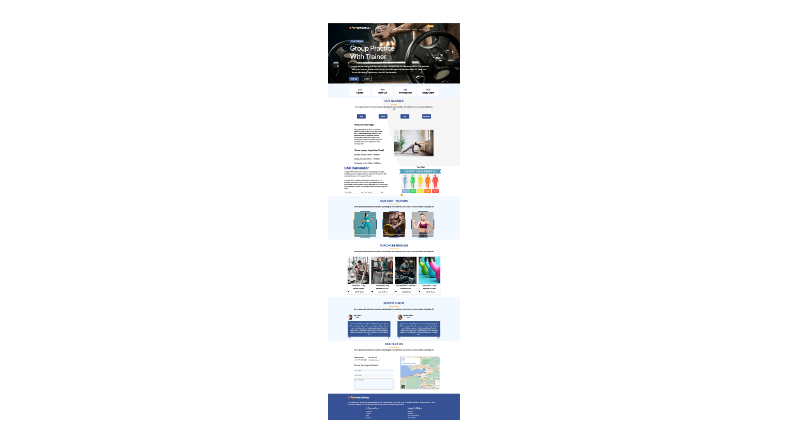
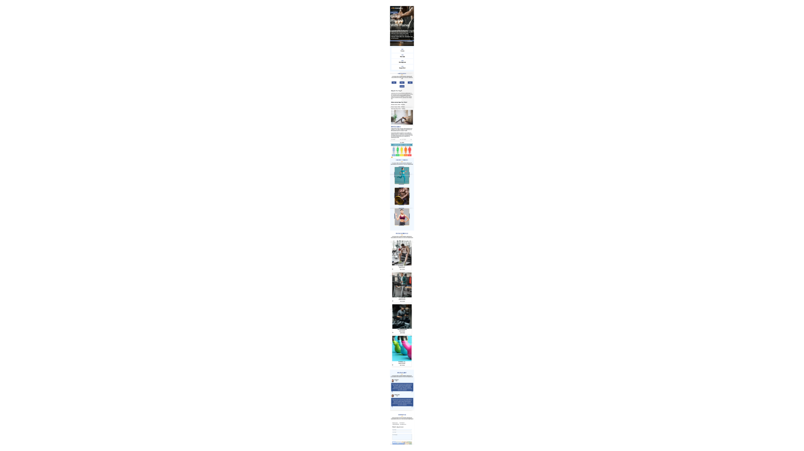

# SPORT CENTER WEBSİTE

## Description
This project is a website for a sport center. The website has a home page, a page for the services, a page for the trainers, a page for the contact information, and a page for the registration form. The website is designed to be responsive and user-friendly. The website is built using HTML, CSS and JavaScript.

## Technologies
- HTML
- CSS
- JavaScript
- Bootstrap
- Google Fonts
- Visual Studio Code
- GitHub

## Features
### Interactive Elements
#### Active Buttons: 
- Interactive buttons under the "Our Classes" section introduce different sports branches with corresponding images.
#### Hover Preview: 
- The last image in the "Our Best Trainers" section offers a hover preview to provide closer looks at the trainers.
### User-Friendly Functionality
#### BMI Calculator: 
- A BMI calculator enables users to calculate their body mass index based on weight and height input, aiding in health and fitness goal setting.
#### Navbar Links: 
- Smooth navigation is ensured through navbar links connected to relevant sections via IDs.
#### Fixed Navbar: 
- The navbar remains fixed at the top of the screen during scrolling, providing constant accessibility.
#### Google Maps Integration: 
- The "Contact" section includes a Google Map displaying the sports center's location for an interactive map experience.
### Responsive Design
- The website is optimized for mobile devices with a screen width of 576px or less, ensuring a seamless user experience across different platforms.

 ### Five Server running at:
  > Local:    http://localhost:5500

## Screenshots
### Desktop Page

### Mobile Page

#### Developer: [Ali Osman UYSAL](https://www.linkedin.com/in/aliosmanuysal/)

